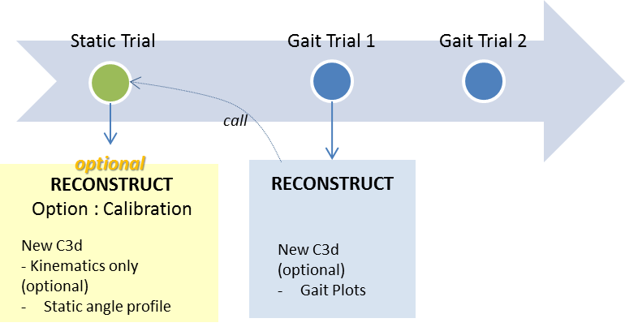
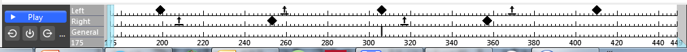
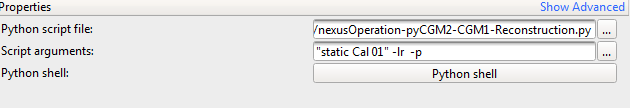

<!---
output:
  html_document:
    toc: true
    toc_depth: 5
--->


<!--html_preserve-->
				<section class="wrapper style2">
					<div class="container">
<!--/html_preserve-->


<div class="jumbotron">
# Table of Contents
<ul>
<li><a href="#basic-conventional-gait-model">Basic Conventional Gait Model</a><ul>
<li><a href="#flowchart">Flowchart</a></li>
<li><a href="#requirements">Requirements</a></li>
<li><a href="#scripts-and-input-arguments">Scripts and Input arguments</a></li>
</ul></li>
</ul>
</div>


## The KAD Conventional Gait Model

There are two variants of the  **Knee Aligment device ** CGM. 

* without medial ankle marker
* with medial ankle markers

### Flowchart 

The flowchart is similar to the basic CGM 
 
The **Reconstruct** operation can be run either on static acquisition or gait trials. The primary goal of **Reconstruct** is to generate a **New c3d Acquisition** with kinematics and kinetics. Optionaly, you can enable gait trace or static angle profile plotting. 





<div class="alert alert-dismissible alert-warning">
  <p> As you can notice on the flowchart:
  
  * reconstruction generates a **NEW** c3d. 
  * reconstruction of the static acquisition is **optional**. Indeed, static calibration is not detached from gait trial reconstruction.</p>

<br>
The python script will find presence KAD and medial ankles markers automatically. A single side KAD can be used. 

</div>


<div class="alert alert-dismissible alert-danger">
**The folowing static process is currently available:**

 * KAD on one knee and **custom offsets** (shank, thigh, tibial torsion) for oppposite leg.  
  
</div>


### Requirements


 * Acquisition fully labelled and gap-free
 * Gait events detected
 * <p class="text-warning">Identify kinetic cycle by adding also a *General event* at  Foot contact</p>. 
 . <br>. Example : General event at frame 308 tags a left hait kinetic cycle.
 * **Use KAD** on one knee at least
 * Medial ankle markers must be labelled: LMED or RMED : Left(Right) Medial marker)
 
 


### Scripts and  Input arguments 

 * Add a python operation to your current pipeline
 * Select script file `Apps/CGM1-pyCGM2/nexusOperation-pyCGM2-CGM1KAD-Reconstruction.py`.
 * Edit input arguments
 
   


**default parameters** are

 * Flat foot options desactivate   
 * Marker Diameter : 14mm 
 * No point suffix (i.e. conventional Vicon nomenclature: LHipAngles, LKneeAnkles,.... ) 
 * Plotting  desactivate
 * normal database from Schwartz 2008 - modality : Free

**Basic usages** of reconstruction only needs editing in the script argument box: 

 * for calibration reconstruction
 
 ```python
    Calibration
```

 * for gait trial reconstruction
 
 ```python
    "static.c3d""
```


**Activate flat foot options and plotting** with these commands

```python
    Calibration -lr -p
    reconstruct.py  "static.c3d" -lr -p
```

a single `-l` enables left flat foot option only. 


**Append a suffix to variable name + change marker diameter** with these commands

```python
    Calibration -lr -p --pointSuffix="cgm1" --markerDiameter=25
    "static.c3d" -lr -p --pointSuffix="cgm1" --markerDiameter=25
```

**Change normative database ** with these commands

```python
examples:
    "static.c3d" -lr -p --pointSuffix="cgm1" --markerDiameter=25 
    --author="Schwartz2008" --modality="veryFast"
```
Current available normative data are :

 * **Author:** Schartz2008 - **modality:** VerySlow, Slow,Free,Fast,VeryFast  
 * **Author:** Pinzone2014 - **modality:** CentreOne, centreTwo  


 

<!--html_preserve-->
</div>
</section>
<!--/html_preserve-->


