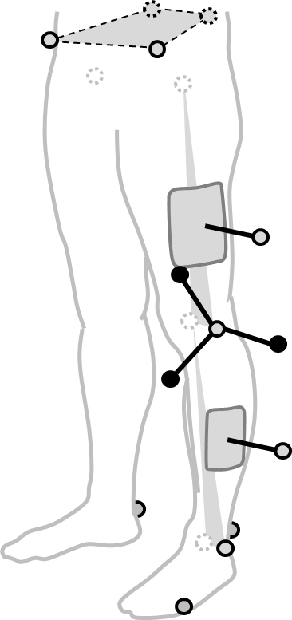
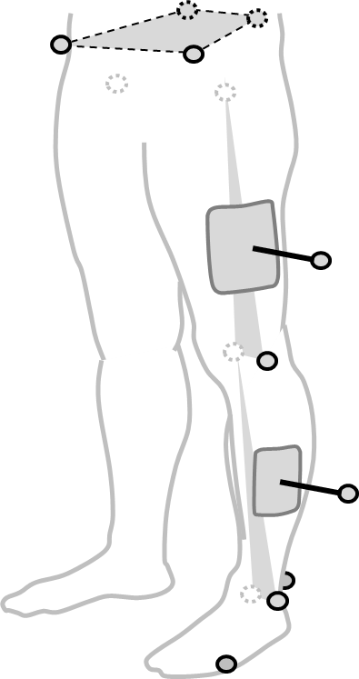

<!---
output:
  html_document:
    toc: true
    toc_depth: 5
--->

<!--html_preserve-->
				<section class="wrapper style2">
					

<!--/html_preserve-->

# Table of Contents
<ul>
<li><a href="#list-of-pycgm2-based-nexus-operations.">List Of pyCGM2-based Nexus operations.</a></li>
</ul>

  
Remind of leaving <b>Unticked the checkbox</b> `Use Nexus Python`</a>  
  Reason is you will call python packages from Anaconda and not from the python site-package folder embedded in Vicon-Nexus. </a>
 

## List Of pyCGM2-based Nexus operations. 

<!--html_preserve-->

  <section class="6u 12u(narrower)">
    

      
      

	      <h3>Virtual KAD</h3>
        

        Create virtual KAD from a knee medial Marker
        

      

    

  </section>
  <section class="6u 12u(narrower)">
    

      
      

	      <h3>Conventional Gait Model 1   Vicon Plugin Gait </h3>
	      
- Process the 3 variants of the CGM1 ( <a href="Nexus2Apps-CGM1.html">basic</a> - <a href="Nexus2Apps-CGM1-KAD.html">KAD/KADmed</a>) 

	      
- Plot and export Spreadsheet 

      

    

  </section>

<!--/html_preserve-->

<!--html_preserve-->

</section>
<!--/html_preserve-->

