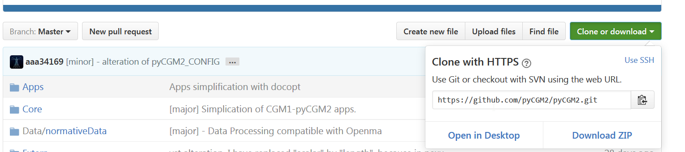
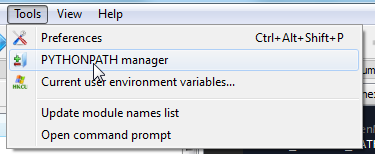
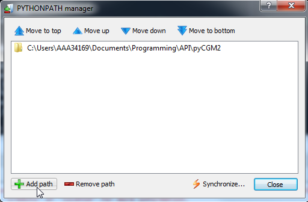
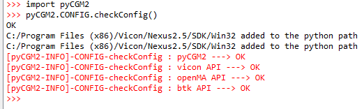

<!---
output:
  html_document:
    toc: true
    toc_depth: 5
--->


<!--html_preserve-->
				<section class="wrapper style2">
					<div class="container">
<!--/html_preserve-->


<div class="jumbotron">
# Table of Contents
<ul>
<li><a href="#recommanded-pc-configuration">RECOMMANDED PC CONFIGURATION</a></li>
<li><a href="#required-python-environnment">REQUIRED PYTHON ENVIRONNMENT</a><ul>
<li><a href="#third-party-open-source-softwares">Third party open source softwares</a><ul>
<li><a href="#btk-biomechanical-toolkit-installation."> - Btk ( Biomechanical ToolKit) installation.</a></li>
<li><a href="#openma-open-motion-analysis"> - OpenMA ( Open Motion Analysis)</a></li>
</ul></li>
</ul></li>
<li><a href="#installation">INSTALLATION</a><ul>
<li><a href="#preliminary">Preliminary</a></li>
<li><a href="#get-pycgm2-code">Get pyCGM2 Code</a><ul>
<li><a href="#download-an-official-release">Download an official Release</a></li>
<li><a href="#keep-in-touch-with-early-development---use-a-versionning-software">Keep in touch with early development - use a versionning software</a></li>
</ul></li>
<li><a href="#configure-pycgm2">Configure pyCGM2</a></li>
<li><a href="#check-your-configuration">check your configuration</a></li>
</ul></li>
</ul>
</div>


## RECOMMANDED PC CONFIGURATION 

pyCGM2 works fine on a PC following [Vicon's specifications](https://www.vicon.com/faqs)  for Nexus 2.


<!--html_preserve--> 
<div class="alert alert-dismissible alert-warning">
  <p>Notice Vicon recommands a Windows7-64-bits PC but Vicon-Nexus was compiled on a 32bits system. Therefore, <b> if you need Vicon compatiblity and working with python operations from Vicon-Nexus, you need to install 32-bits python packages only</b></p>
</div>
<!--/html_preserve-->


## REQUIRED  PYTHON ENVIRONNMENT 


pyCGM2 was designed according this diagram :
<center>
  <br>
</center>

pyCGM2 uses **python 2.7**

Code imports common scientifical packages (numpy, scipy, matplotlib,pandas,...) provided by most of python suite (Anaconda, pythonxy, canopy). **We recommmand the use of [Anaconda2 (32bits)](https://www.continuum.io/downloads)**

Anaconda provides Spyder IDE ( a matlab-like editor) that help you to code and configure you python system path


### Third party open source softwares

In addition to common scientifical package, pyCGM2 needs both motion analysis-dedicated packages : Openma an Btk.

<span class="label label-info">INFO</span> Being an evolution of Btk, opemMA will be likely the only third party software in a future release of pyCGM2.

####   - Btk ( Biomechanical ToolKit) installation. 


Installation can be done by two methods : 

 * download an install preBuilt 32bits source from [pypi]( https://pypi.python.org/pypi/btk/0.3).</li>
 * **OR** As anaconda provided the easy installer command: *pip*, you can type this line in a MS-DOS command.<br/>
 `pip install https://pypi.python.org/packages/2.7/b/btk/btk-0.3.0-1_i686.rpm` </li>

 
   
####   - OpenMA ( Open Motion Analysis)

An openma 32-bits distribution is embebbed in pyCGM2. **You don't need installing anything**<br/> 
Follow openMa build instructions or contact openMA admisnistrator to get your own distribution. 


## INSTALLATION


### Preliminary 

 1. Install your python environment (Anaconda)
 2. Install Btk ( see above section)


### Get pyCGM2 Code

Two alternatives are possible: 

#### Download an official Release

 3. Download and unzip last release of  pyCGM2 from [github](https://github.com/pyCGM2/pyCGM2/releases)
 4. Open file : `pyCGM2_CONFIG.py` in the main folder


#### Keep in touch with early development - use a versionning software

 3. Install a versionning sofware (SourceTree, gitHub desktop,...)  
 4. Clone the https adress from github in your versionning software
  <br>


### Configure pyCGM2 

 
 5. Open file : `pyCGM2_CONFIG.py` in the main folder
 6. Alter required path (`MAIN_PYCGM2_PATH`)
 7. **[Vicon Nexus Users]** if you want to call pyCGM2 from Vicon-Nexus, in `pyCGM2_CONFIG.py`, indicate locations of `NEXUS_SDK_WIN32`,`NEXUS_SDK_PYTHON` and  `PYTHON_NEXUS`
 8. Add pyCGM2 to your python system path <br>
 A convenient method is to use spyder IDE: <br>
 Open Sypder, and click *Tools/PYTHONPATH manager* <br>
 <br>
 Click *Add Path* and add your pyCGM2 path. Then click *Synchronize*. A new variable `PYTHONPATH` will be add to your windows environment.<br>
<br>
 
 
**pyCGM2 is now set up on your PC**


### Check your configuration

 * Open Spyder ( or another python console)
 * Type this snippet:
```python
  import pyCGM2
  pyCGM2.pyCGM2_CONFIG.checkConfig()
```

pyCGM2 is ready to use if you obviously get no error messages.<br>
 
 

<!--html_preserve-->
</div>
</section>
<!--/html_preserve-->


